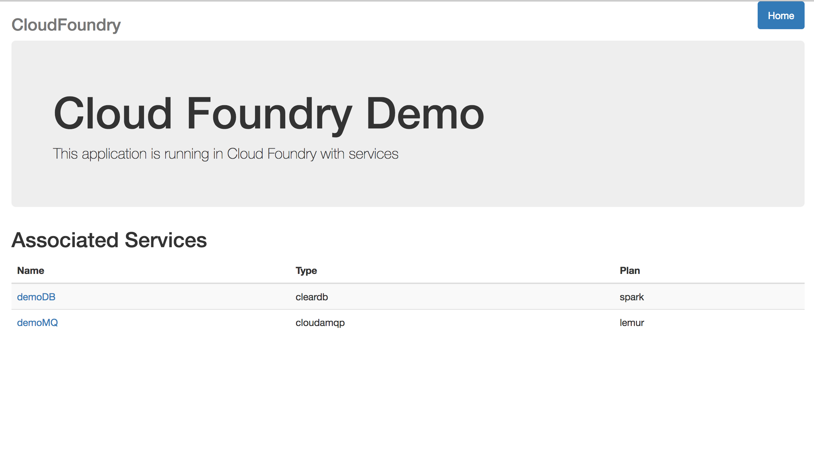
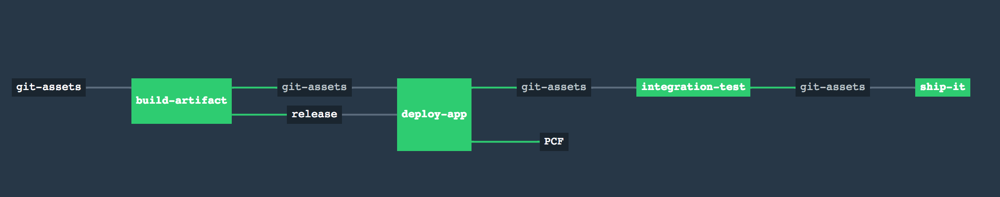

# Spring Boot and Pivotal Cloud Foundry Demo



This is a basic demonstraton of Spring Boot, Pivotal Cloud Foundry and Concourse.

At its core it is a basic app showing associated services. The ```pipelines/``` folder includes the Concourse CI/CD pipeline to do basic building, deployment and testing of the application - as well as blue/green deployment.



I use this for my customer demonstrations so feel free to study, copy and modify!
